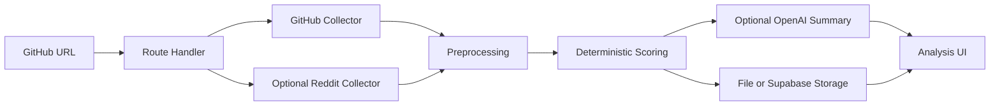

# AI Hype Radar

[](https://github.com/gogun-rgb/ai-hype-radar/actions/workflows/ci.yml)

[Korean README](README.md)

AI Hype Radar is a Next.js portfolio project that analyzes GitHub and Reddit signals to separate open-source AI project traction from real-world usefulness and risk. The app does not ask an LLM to invent scores. It calculates Hype Score, Reality Score, and Risk Score from deterministic normalized signals, then optionally uses OpenAI only to enrich the qualitative explanation. Rule-based analysis and Demo Mode work without API keys.

## Portfolio Highlights

- End-to-end analysis flow from GitHub URL validation to data collection, scoring, evidence cards, persistence, and result UI
- Fair scoring when Reddit data is missing: unavailable signals are excluded and remaining weights are normalized
- Data Coverage and Confidence Level make missing data visible instead of hiding it inside a score
- Graceful fallback when OpenAI, Reddit, or Supabase is not configured
- TypeScript types, Vitest unit/integration tests, Playwright E2E, and GitHub Actions CI
- Canva-ready card-news prompt generation for repurposing an analysis result

## Current Verification Status

Latest local verification:

| Check | Result |
| --- | --- |
| Vitest unit/integration tests | 11 files, 29 tests passed |
| Playwright E2E | 2 desktop/mobile tests passed |
| Coverage | Statements 83.2%, Branches 61.33%, Functions 79.02%, Lines 83.44% |
| CI | GitHub Actions runs typecheck, lint, test, coverage, build, and E2E |

## Features

- GitHub repository URL validation
- GitHub metadata, recent issues, commits, releases, contributors, and README collection
- Reddit official API search when credentials are configured
- Explicit Reddit status handling for not configured, failed, rate limited, insufficient, and available data
- Deterministic Hype Score, Reality Score, Risk Score, Confidence Level, and Data Coverage
- Evidence cards linked back to GitHub issues, Reddit posts, or README sections
- Canva-ready 6-slide vertical card-news prompt
- File-based persistence when Supabase is unavailable

## Tech Stack

- Next.js App Router, React, TypeScript
- Tailwind CSS, Recharts, Lucide Icons
- Zod, Vitest, React Testing Library, Playwright
- GitHub REST API, Reddit API, OpenAI API
- Supabase PostgreSQL or local file storage
- GitHub Actions CI

## Project Structure

```text
src/
  app/                  Next.js pages and route handlers
  components/           Analysis UI, charts, layout components
  config/scoring.ts     Score weights and normalization thresholds
  lib/analysis          Analysis orchestration and source building
  lib/github            GitHub API client and demo fallback
  lib/reddit            Reddit OAuth search client
  lib/openai            Optional structured qualitative summary
  lib/scoring           Deterministic score calculation utilities
  lib/preprocessing     README parsing, classification, sanitization
  lib/storage           File and Supabase persistence
  tests/                Unit, integration, and E2E tests
supabase/migrations     Database schema
.github/workflows       CI workflow
```



## Quick Start

```bash
npm install
cp .env.example .env.local
npm run dev
```

Windows PowerShell:

```powershell
Copy-Item .env.example .env.local
npm.cmd run dev
```

Open `http://localhost:3000` and try:

```text
https://github.com/vercel/ai
```

## Environment Variables

| Variable | Purpose | Behavior when missing |
| --- | --- | --- |
| `GITHUB_TOKEN` | Increases GitHub API rate limits | Public repositories are fetched anonymously |
| `OPENAI_API_KEY` | Enables AI-generated explanation and claim comparison | Rule-based summary is used |
| `OPENAI_MODEL` | Model used for OpenAI explanation | Defaults to `gpt-4o-mini` |
| `REDDIT_CLIENT_ID` | Reddit OAuth search | Reddit signal is excluded from scoring |
| `REDDIT_CLIENT_SECRET` | Reddit OAuth search | Reddit signal is excluded from scoring |
| `REDDIT_USER_AGENT` | Required Reddit API User-Agent | Reddit signal is excluded from scoring |
| `NEXT_PUBLIC_SUPABASE_URL` | Supabase project URL | File-based storage is used |
| `NEXT_PUBLIC_SUPABASE_ANON_KEY` | Supabase public anon key | Not required for the current server-side MVP |
| `SUPABASE_SERVICE_ROLE_KEY` | Server-side persistence | File-based storage is used |
| `NEXT_PUBLIC_APP_URL` | App URL | Localhost is used |
| `DEMO_MODE` | Demo fallback when external APIs fail | If `true`, explicit sample data is used |

Never commit real API keys. Keep them in `.env.local`.

Demo Mode and API-key-free execution:

- `DEMO_MODE=true` uses explicit demo fallback data when external APIs fail.
- `E2E_DEMO=true` is a test-only setting used by Playwright to avoid live external API calls.
- Without Supabase, analyses are stored in `.ai-hype-radar/analyses.json`.
- Local file storage is intended for development and demo use, not multi-user production hosting.

## Scoring

All scores are clamped to 0-100.

Hype Score:

- Star momentum or age-adjusted first-analysis star momentum: 40%
- Reddit mentions: 30%
- Fork momentum or fork ratio: 15%
- Recent issue and commit activity: 15%

Reality Score:

- Recent commit activity: 20%
- Installation success signals: 25%
- Issue resolution speed: 20%
- README completeness: 20%
- Real output examples: 15%

Risk Score:

- Unresolved bugs: 25%
- Security and privacy signals: 25%
- Cost uncertainty: 20%
- Installation complexity: 15%
- Vendor/API dependency: 15%

Reality is better when higher. Risk is more dangerous when higher.

## How to Interpret the Scores

| Score | Higher means | Lower means |
| --- | --- | --- |
| Hype Score | Strong public attention and recent activity | Weak public traction or activity signals |
| Reality Score | Strong documentation, maintenance, and real-use evidence | More validation is needed before trusting real-world utility |
| Risk Score | More installation, cost, security, or dependency risk signals | Fewer visible risk signals in collected evidence |

Confidence Level describes the quality of the evidence behind the scores. When data is sparse, the app lowers confidence and exposes Data Coverage instead of overstating certainty.

## Missing Data Handling

AI Hype Radar distinguishes “no data” from “real lack of reaction.”

- If Reddit credentials are missing or the API fails, Reddit is not treated as a zero score.
- Unavailable signals are excluded and the remaining available weights are normalized.
- If Reddit search succeeds but finds no posts, that is counted as a low mention signal.
- Missing or limited data is reflected in Data Coverage and Confidence Level.
- If all core signals are missing, the app does not invent a healthy score; it returns a low-confidence, data-limited result.

Weight normalization:

```text
effectiveWeight = originalWeight / sumOfAvailableWeights
```

## API and Stored Data

The analysis API returns coverage metadata inside `analysis.scores`.

- `hype`, `reality`, `risk`: score value, breakdown, original weight, effective weight, missing signals
- `confidence`: `High`, `Medium`, or `Low`
- `confidenceReasons`: why the confidence level was assigned
- `dataCoverage`: source status, collected count, expected count, coverage, and score impact

Data source status:

```ts
type DataSourceStatus =
  | "available"
  | "unavailable"
  | "not_configured"
  | "rate_limited"
  | "failed"
  | "insufficient";
```

## Verification

| Command | Purpose |
| --- | --- |
| `npm run typecheck` | Generate Next.js route types and run TypeScript checks |
| `npm run lint` | Run ESLint |
| `npm run test` | Run Vitest unit and integration tests |
| `npm run test:coverage` | Measure coverage and enforce thresholds |
| `npm run build` | Verify the production build |
| `npm run test:e2e` | Run Playwright desktop/mobile E2E |
| `npm run check` | Run typecheck, lint, test, and build |

GitHub Actions CI runs typecheck, lint, test, coverage, build, and E2E. The workflow verifies the project only and does not deploy it.

## Supabase Setup

Create a Supabase project, open SQL Editor, and run:

```text
supabase/migrations/001_initial_schema.sql
```

Then fill in `NEXT_PUBLIC_SUPABASE_URL` and `SUPABASE_SERVICE_ROLE_KEY` in `.env.local`. If Supabase is not configured, analyses are stored in a local file.

## Security Notes

- `.env`, `.env.local`, and `.env.*.local` are ignored by Git.
- The app does not log API keys or authorization headers.
- Preprocessing masks strings that look like API keys or tokens.
- Only `github.com/owner/repo`-style repository URLs are accepted.
- External API calls use timeouts and fall back gracefully where possible.
- See [SECURITY.md](SECURITY.md) for reporting instructions and static-analysis limitations.

## Maintenance Docs

- [CONTRIBUTING.md](CONTRIBUTING.md): local setup, testing expectations, and PR guidance
- [CHANGELOG.md](CHANGELOG.md): release history
- [SECURITY.md](SECURITY.md): vulnerability reporting and analysis limitations
- [tests/README.md](tests/README.md): test locations and commands

## Roadmap

1. Automatic rising-repository detection
2. Scheduled snapshot collection
3. Multi-repository comparison
4. Automatic card-news image generation
5. Search trend API integration

## License

MIT
